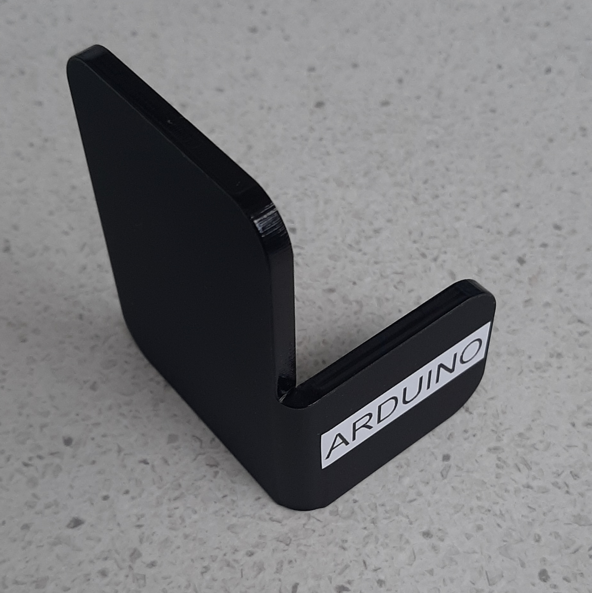
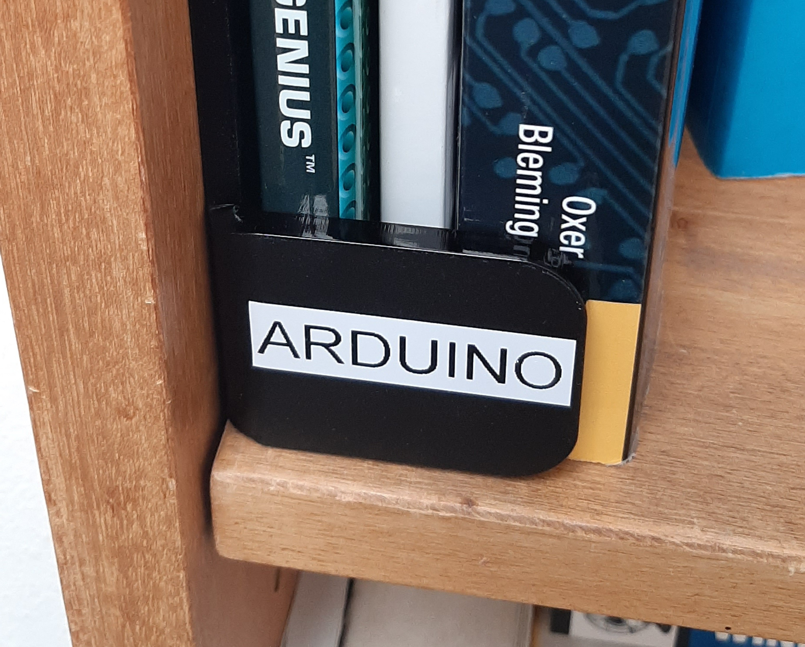

# Book label

A bookshelf label to organise your books.

## Instructions

- Open the dxf in the laser cutter.
- Use the Acrylic Bending Machine to fold the short side 90 degres. It requires at least 10 minutes per side of heating.

## Links

Filename                                                     | Description
--------                                                     | -----------
[book-label.dxf]({{site.gh_project_baseurl}}/book-label/book-label.dxf) | Two labels to reduce waste of acrylic.
[Github directory]({{site.gh_project_baseurl}}/book-label/) | The github directory

